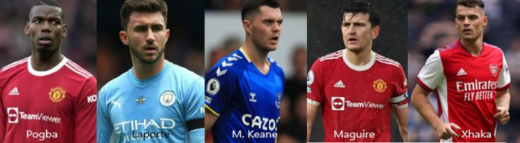
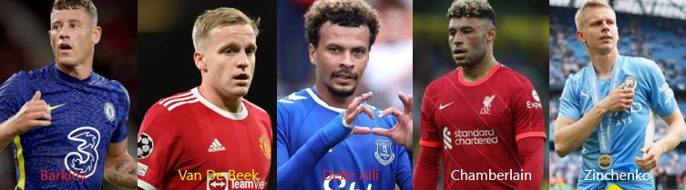
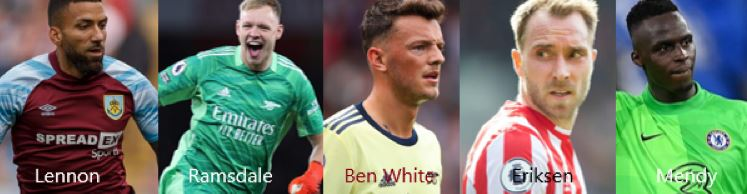

```{=html}
<style>

body {
text-align: justify}

</style>
```

```{r setup, include=FALSE}
# clear-up the environment
rm(list = ls())

# chunk options
knitr::opts_chunk$set(
  message = FALSE,
  warning = FALSE,
  fig.align = "center",
  comment = "#>"
)

options(scipen = 9999)
```

English Premier League is one of the most famous in the world, if it's
not the best football league out there. They are so entertaining. They
play so fast and physical. No wonder many people watch their match.
</br> There are many good player there. What I am trying do right here
is to explore more about them. With hope we can see more which one that
actually a good player. Because with the data we can do analysis more
such as get more insight with combining Principal Component Analysis
(PCA) and Clustering</br>

```{r, echo=FALSE, fig.align='center'}
knitr::include_graphics("720.gif")
```

# Import Library

```{r, warning=FALSE, message=FALSE}

library(GGally)
library(gridExtra)
library(factoextra)
library(FactoMineR)
library(plotly)
library(dplyr)
library(tidyr)
```

# Import Data

I get the dataset from Kaggel. This dataset contains Stats of football
player from Premier League (2021-2022). You can check
[here](https://www.kaggle.com/datasets/omkargowda/football-players-stats-premier-league-20212022)

```{r}
# Read data
epl <- read.csv('Football Players Stats (Premier League 2021-2022).csv')
glimpse(epl)
```

About the data :

`Player` : Player's name </br> `Team` : Played club in 2021-2020 </br>
`Nation` : Player's nation </br> `Pos` : Position </br> `Age` : Player's
age </br> `MP` : Matches played </br> `Starts` : Matches started </br>
`Min` : Minutes played </br> `90s` : Minutes played divided by 90 </br>
`Gls` : Goals scored or allowed </br> `Ast` : Assists </br> `G-PK` : Non
Penalty Goals </br> `PK` : Penalty Kicks made </br> `PKatt` : Penalty
Kicks attended </br> `CrdY` : Yellow Cards </br> `CrdR` : Red Cards
</br> `Gls` : Goals scored per 90 mins </br> `Ast` : Assits per 90 mins
</br> `G+A` : Goals and Assists per 90 mins </br> `G-PK` : Goals minus
Penalty Kicks made per 90 mins </br> `G+A-PK` : Goals plus Assists minus
Penalty Kicks made per 90 mins </br> `xG` : Expected Goals </br> `npxG`
: Non-Penalty Expected Goals </br> `xA` : Expected Assits </br>
`npxG+xA` : Non-Penalty Expected Goals plus Expected Assists </br> `xG`
: Expected Goals per 90 mins </br> `npxG` : Non-Penalty Expected Goals
made per 90 mins </br> `xA` : Expected Assits made per 90 mins </br>
`npxG+xA` : Non-Penalty Expected Goals plus Expected Assists made per 90
mins </br>

This data actually good. Many thing we can do with this. But in this
article, I only going to explore players' statistic with unsupervised
learning. Unsupervised learning refers to the use of artificial
intelligence (AI) algorithms to identify patterns in data sets including
data points that are neither classified nor labeled. In this case we use
machine learning, with the help of R in Rstudio.

# Data Wrangling

Check the missing value

```{r}
is.na(epl) %>% colSums()
```

It has missing value. We can drop them.

```{r}
epl_drop <- epl %>% drop_na()
anyNA(epl_drop)
```

We only going to use numeric column from dataset and name player

```{r}
epl_unique<- epl_drop[!duplicated(epl_drop$Player), ]
```

```{r}
# Assign the player column as rownames
rownames(epl_unique) <- epl_unique$Player
```

```{r}
# select the column
epl_clean <- epl_unique %>% 
  select(-c(Player, Age, Team, Nation, Pos, Min)) 
head(epl_clean)
```

```{r}
```

# Exploratory Data Analysis and Scaling

Make sure the data only have numeric value because we k-means (it going
to compute with the ecludean distance)

```{r}
str(epl_clean)
```

Check the data variance with `summary()`

```{r}
summary(epl_clean)
```

These variables still has different scaling.

```{r}
epl_scale <- scale(epl_clean)
head(epl_scale)
```

# Data Pre-processing

## Unsupervised Learning : Clustering

Find the k optimum

```{r}
library(factoextra)

fviz_nbclust(
  x = epl_scale,
  FUNcluster = kmeans,
  method = "wss"
)
```

From the plot graph, we can see that 4 is the optimum of K. Because it
made elbow (elbow method). So we can divide EPL's players to 4 clusters.

```{r}
# k-means clustering
RNGkind(sample.kind = "Rounding")
set.seed(70)

epl_cluster <- kmeans(epl_scale, centers = 4)

# calculate the size for every cluster
epl_cluster$size
```

The second cluster is the biggest and the first cluster is the smallest.
My guess it would seperate from best, good, average, and bad player.

```{r}
# calculate the center for every cluster
epl_cluster$centers
```

Label the cluster for every observation

```{r}
as.data.frame(epl_cluster$cluster) %>% head()
```

# Cluster Profiling

Make new column with label cluster information

```{r}
epl_clean$cluster <- epl_cluster$cluster
```

Check the first 6 rows of the data

```{r}
head(epl_clean)
```

# Grouping data based on cluster label

Grouping based on cluster label, so we can learn the character from each
cluster

```{r}
epl_clean %>% 
  group_by(cluster) %>% 
  summarise_all(mean)
```

# Filtering data based on cluster label

```{r}
# Show some of players from cluster 1
epl_clean[epl_clean$cluster==1,] %>% head()
```

```{r}
# Show some of players from cluster 2
epl_clean[epl_clean$cluster==2,] %>% head()
```

```{r}
# Show some of players from cluster 3
epl_clean[epl_clean$cluster==3,] %>% head()
```

```{r}
# Show some of players from cluster 4
epl_clean[epl_clean$cluster==4,] %>% head()
```

# Visualization

```{r}
# Visualization in 2 dimensition
library(ggiraphExtra)

ggRadar(
  data=epl_clean,
  mapping = aes(colours = cluster),
  interactive = T
)
```

```{r}
# Visualization for cluster profiling

# Make the model
library(ggiraphExtra)
epl_pca1 <- PCA(X = epl_clean, # data
               scale.unit = T, #untuk menentukan data agar tidak di scaling
               quali.sup = 25, #index kolom dari variable cluster
               graph=F) #disable graph

# Visualize the model
fviz_pca_biplot(epl_pca1,
                habillage = "cluster", #kolom pewarnaan
                geom.ind = "point", # menampilkan titik observasi saja
                addEllipses = T, # membuat elips disekitar cluster
                col.var = "navy") # warna panah dan teks variabl

```
That is not many thing we can see here, because we have many variables. Let't find centroid in every cluster then group them and summarize by their maximum value and minimum value. Then we can do cluster profiling. 

```{r}
# Find Centroid in every cluster
epl_centroid <- epl_clean %>% 
  group_by(cluster) %>% 
  summarise_all(mean)
epl_centroid
```

```{r}
# Grouping the centroid to min group and max group
epl_centroid %>% 
  pivot_longer(-cluster) %>% 
  group_by(name) %>% 
  summarize(
    min_group = which.min(value),
    max_group = which.max(value))
```

# Profiling every cluster

**Cluster 1** </br> 
- Max in aspect : `CrdR` (Red Cards), `CrdY` (Yellow Cards) </br>
- Min in aspect : `npxG.xA.1` (Non-Penalty Expected Goals made per 90 mins) , `xA.1` (Expected Assist made per 90 mins), `xG.1` (Expected Goal per 90 mins), `xG.xA` (Expected Assist & Goal) </br> 
- Label         : **Rough player** </br> 
- Description   : These kind of player that easily foul the opponent. They maybe have a lot duty in defense. </br>

```{r echo=FALSE}

```
</br>

**Cluster 2** </br> 
- Max in aspect : none </br> 
- Min in aspect : `Ast` (Assists), `Ast.1`(Assist per 90 mins), `CrdY`(Yellow Cards), `G.A`(Goals and Assists per 90 mins), `G.A.PK`(Goals plus Assists minus Penalty Kicks made per 90 mins), `G.PK`(Non Penalty Goals), `G.PK.1`(Goals minus Penalty Kicks made per 90 mins ), `Gls`(Goals scored or allowed), `Gls.1`(Goals scored per 90 mins), `MP`(Matches played ), `npxG`(Non-Penalty Expected Goals), `npxG.xA`(Non-Penalty Expected Goals ), `PK`(Penalty Kicks made), `PKatt`(Penalty Kicks attended ), `Starts`(Matches started ), `X90s`(90 minutes Expected Played), `xA`(Expected Assists ), `xG`(Expected Goals) </br>
- Label : **Bench warmer** </br> 
- Description : These kind of player is almost has minimum contribution to the team. They have tendecy to spend of their time in bench. </br>

```{r echo=FALSE}

```
</br>

**Cluster 3** </br>
- Max in aspect : `Ast` (Assists), `Ast.1`(Assist per 90 mins),`G.A`(Goals and Assists per 90 mins), `G.A.PK`(Goals plus Assists minus Penalty Kicks made per 90 mins), `G.PK`(Non Penalty Goals),`G.PK.1`(Goals minus Penalty Kicks made per 90 mins ),`Gls`(Goals scored or allowed),`Gls.1`(Goals scored per 90 mins), `MP`(Matches played ), `npxG`(Non-Penalty Expected Goals), `npxG.1`(Non-Penalty Expected Goals made per 90 mins ), `npxG.xA`(Non-Penalty Expected Goals plus Expected Assists), `npxG.xA.1`(Non-Penalty Expected Goals plus Expected Assists made per 90 mins),`PK`(Penalty Kicks made), `PKatt`(Penalty Kicks attended ),`xA`(Expected Assist), `xA.1`(Expected Assits made per 90 mins), `xG`(Expected Goals), `xG.1`(Expected Goals per 90 mins), `xG.xA`(Expected Goals plus Expected Assists)</br>
- Min in aspect : None</br> 
- Label : **Key Player**</br>
- Description : These kind of player that
contribute a lot in attack. They do a lot in final third, usually
their position are attacking midfielder and striker. </br>

```{r echo=FALSE}

```
</br>

**Cluster 4** </br> 
- Max in aspect : `Starts`(Matches started), `X90s`(Expected Minutes played divided by 90)
- Min in aspect : `npxG.1`(Non-Penalty Expected Goals)</br> 
- Label : **First Team Player**</br> 
- Description : These kind of player that play the most of match. Their contribution maybe not a lot in attacking, but maybe they contribute in other area.</br>

```{r echo=FALSE}

```

# Conclusion
This article Unsupervised Learning : English Premier League 2020 - 2021 can be use to help manager or staff team to analysis opponent team. We could get which player that actually danger in front of goal. Or which player that play dirty, we may want avoid these players on duel because they could injure our player. </br>
</br>
Unsupervised learning main purpose is exploring our data, with hope get interisting or new information . I can say this purposed fulfilled here. We know a lot more about player in English Premier League (season 2020-2021).
